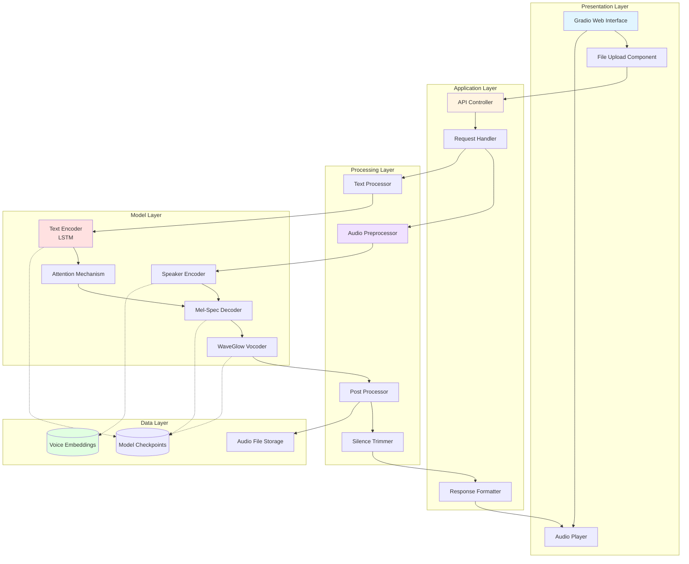
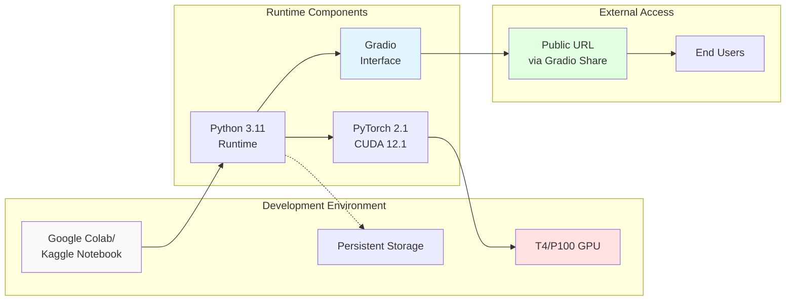
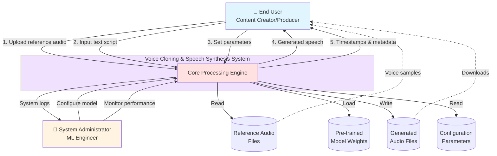
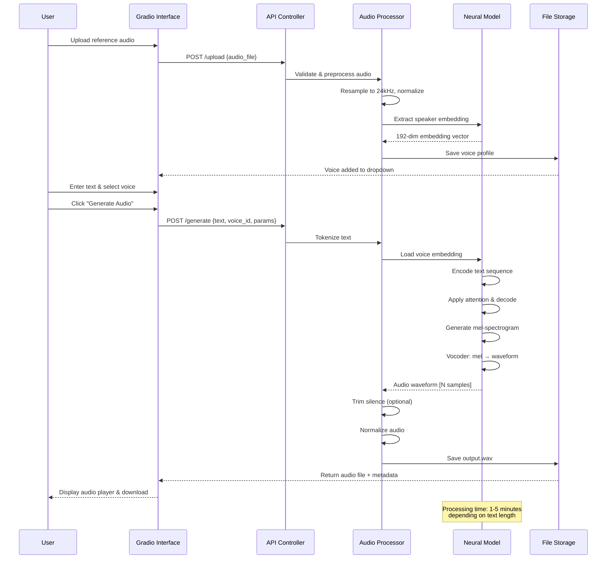
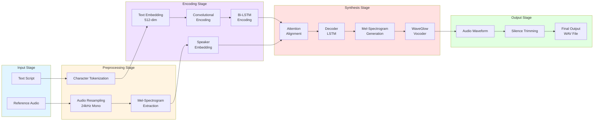
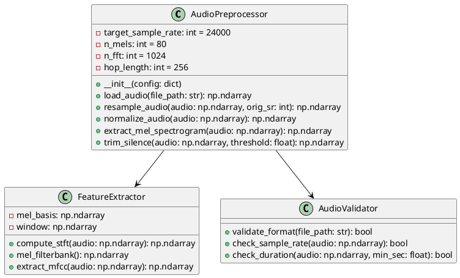
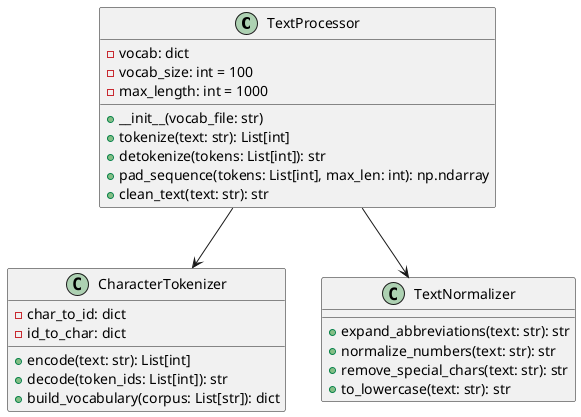
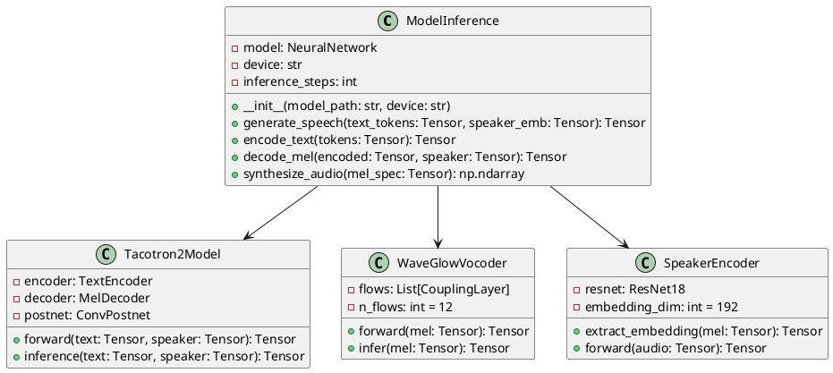
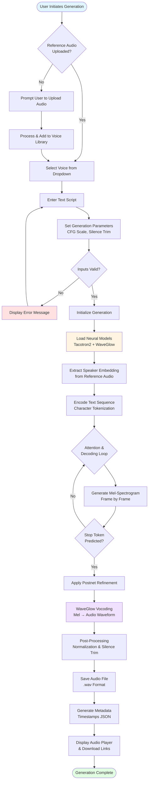
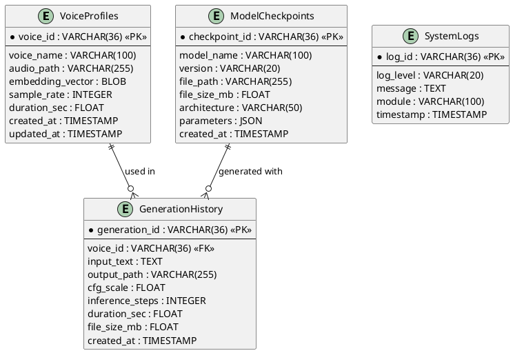

# Chapter 4: System Design

## 4.1 System Perspective / Architectural Design

The Voice Cloning and Speech Synthesis System is designed as a modular, end-to-end neural network-based architecture that transforms textual input into natural-sounding speech using cloned voice characteristics. The system follows a layered architecture pattern, separating concerns between data processing, neural model inference, and user interaction layers.

### High-Level Architecture

The system architecture consists of five primary layers:

1. **Presentation Layer**: Gradio-based web interface for user interaction
2. **Application Layer**: Request handling, preprocessing orchestration, and response formatting
3. **Processing Layer**: Audio feature extraction, text tokenization, and post-processing
4. **Model Layer**: Neural network components (Tacotron2 encoder-decoder, vocoder)
5. **Data Layer**: Voice embeddings storage, model checkpoints, and audio file management



### Architecture Components

**Presentation Layer Components:**
- **Web Interface**: Gradio-based UI providing file upload, parameter controls, and audio playback
- **Upload Handler**: Manages reference audio file uploads (WAV, MP3, FLAC formats)
- **Visualization**: Real-time generation logs and audio waveform display

**Application Layer Components:**
- **API Controller**: Routes requests between interface and processing layers
- **Request Handler**: Validates inputs, manages session state, and coordinates processing pipeline
- **Response Formatter**: Structures generated audio, timestamps, and metadata for client delivery

**Processing Layer Components:**
- **Audio Preprocessor**: Resamples audio to 24kHz, converts to mono, normalizes amplitude
- **Feature Extractor**: Computes mel-spectrograms (80 bins) and MFCCs from audio waveforms
- **Text Processor**: Tokenizes input text, handles character-level encoding
- **Post Processor**: Applies silence trimming, audio normalization, and format conversion

**Model Layer Components:**
- **Text Encoder**: Bidirectional LSTM network (256 hidden units) encoding text sequences
- **Attention Mechanism**: Location-sensitive attention aligning text and audio representations
- **Decoder**: Autoregressive decoder generating mel-spectrograms with Prenet/Postnet layers
- **Vocoder**: WaveGlow neural vocoder converting spectrograms to audio waveforms
- **Speaker Encoder**: ResNet-based network extracting voice embeddings (192-dimensional vectors)

**Data Layer Components:**
- **Voice Embeddings Database**: Stores extracted speaker embeddings for voice cloning
- **Model Checkpoints**: Persists trained model weights and configuration
- **Audio Storage**: File system for reference audio and generated outputs

### Deployment Architecture

The system supports deployment in cloud-based notebook environments (Kaggle, Google Colab) with GPU acceleration:



## 4.2 Context Diagram

The context diagram illustrates the system's boundaries and interactions with external entities. The Voice Cloning System operates as a self-contained unit processing user inputs and generating audio outputs.



### Context Description

**External Entities:**

1. **End User (Content Creator/Producer)**
   - Uploads reference audio clips (10-30 seconds) of target voice
   - Inputs text scripts for speech synthesis
   - Configures generation parameters (CFG scale, silence trimming)
   - Receives generated audio files and associated metadata

2. **System Administrator (ML Engineer)**
   - Manages model configurations and hyperparameters
   - Monitors system performance and resource utilization
   - Reviews generation logs and error reports
   - Performs model updates and maintenance

**External Data Stores:**

1. **Reference Audio Files**: User-provided voice samples in various formats (WAV, MP3, FLAC)
2. **Pre-trained Model Weights**: Neural network checkpoints and configuration files
3. **Generated Audio Files**: System output including synthesized speech and timestamps
4. **Configuration Parameters**: System settings, hyperparameters, and user preferences

**System Boundaries:**

The system boundary encompasses all neural network processing, audio manipulation, and interface components. External to the system are the users, raw input files, and persistent storage. The system does not include video processing, real-time streaming services, or external API integrations.

**Data Flow Summary:**

- **Input Flow**: Reference audio → Feature extraction → Voice embedding
- **Processing Flow**: Text + Voice embedding → Neural synthesis → Audio waveform
- **Output Flow**: Generated audio → Post-processing → File storage → User download

---

# Chapter 5: Detailed Design

## 5.1 System Design

The detailed system design elaborates on the internal architecture, focusing on component interactions, data transformations, and processing workflows. This section provides implementation-level specifications for each major subsystem.

### Neural Network Architecture

The core of the system is built around a sequence-to-sequence architecture with attention mechanisms, specifically designed for text-to-speech synthesis with voice cloning capabilities.

```mermaid
graph TD
    subgraph "Input Processing"
        TextIn[Text Input<br/>'Hello World']
        AudioIn[Reference Audio<br/>24kHz WAV]
        TextEnc[Character Tokenizer<br/>Vocab: 100 chars]
        AudioFeat[Feature Extractor<br/>Mel-Spec: 80 bins]
    end
    
    subgraph "Encoder Network"
        CharEmbed[Character Embedding<br/>Dimension: 512]
        ConvLayers[3x Conv1D Layers<br/>Kernel: 5, Filters: 512]
        BiLSTM[Bi-LSTM Layers<br/>2 layers, 256 units each]
        EncOut[Encoder Output<br/>Shape: [T, 512]]
    end
    
    subgraph "Speaker Embedding"
        SpkNet[ResNet Speaker Encoder<br/>18 layers]
        SpkEmbed[Speaker Embedding<br/>192-dimensional vector]
        SpkTile[Tile & Concatenate<br/>to each decoder step]
    end
    
    subgraph "Attention & Decoder"
        Attention[Location-Sensitive<br/>Attention]
        Prenet[Prenet<br/>2x FC: 256 units]
        DecLSTM[Decoder LSTM<br/>2 layers, 1024 units]
        Postnet[Postnet<br/>5x Conv1D: 512 filters]
        MelOut[Mel-Spectrogram<br/>Shape: [N, 80]]
    end
    
    subgraph "Vocoder"
        WaveGlow[WaveGlow Vocoder<br/>12 coupling layers]
        AudioOut[Audio Waveform<br/>24kHz, Float32]
    end
    
    TextIn --> TextEnc
    TextEnc --> CharEmbed
    CharEmbed --> ConvLayers
    ConvLayers --> BiLSTM
    BiLSTM --> EncOut
    
    AudioIn --> AudioFeat
    AudioFeat --> SpkNet
    SpkNet --> SpkEmbed
    
    EncOut --> Attention
    SpkEmbed --> SpkTile
    Attention --> Prenet
    SpkTile --> DecLSTM
    Prenet --> DecLSTM
    DecLSTM --> Postnet
    Postnet --> MelOut
    
    MelOut --> WaveGlow
    WaveGlow --> AudioOut
    
    style TextIn fill:#e1f5ff
    style AudioIn fill:#e1f5ff
    style EncOut fill:#fff4e1
    style SpkEmbed fill:#f0e1ff
    style MelOut fill:#ffe1e1
    style AudioOut fill:#e1ffe1
```

### Component Specifications

**Text Encoder:**
- **Input**: Character sequence (max length: 1000)
- **Character Embedding**: 512-dimensional vectors
- **Convolutional Layers**: 3 layers, kernel size 5, 512 filters, ReLU activation
- **Bi-LSTM**: 2 layers, 256 hidden units per direction (512 total)
- **Output**: Encoded sequence of shape [sequence_length, 512]
- **Purpose**: Captures linguistic context and phonetic information from text

**Speaker Encoder:**
- **Architecture**: ResNet-18 backbone modified for audio input
- **Input**: Mel-spectrogram of reference audio (80 mel bins × time frames)
- **Layers**: 18 convolutional layers with residual connections
- **Output**: 192-dimensional speaker embedding vector
- **Purpose**: Extracts voice-specific characteristics (timbre, pitch, speaking style)
- **Training**: Pre-trained on speaker verification task for robust embeddings

**Attention Mechanism:**
- **Type**: Location-sensitive attention with cumulative weights
- **Query**: Current decoder hidden state (1024-dim)
- **Keys/Values**: Encoder outputs (512-dim)
- **Location Features**: 1D convolution on attention weights (32 filters, kernel 31)
- **Alignment**: Soft attention weights over input sequence
- **Purpose**: Aligns decoder output with corresponding input text positions

**Decoder Network:**
- **Prenet**: 2 fully-connected layers (256 units each), dropout 0.5, ReLU
- **LSTM**: 2 layers, 1024 units per layer, unidirectional
- **Input**: Previous mel-frame + speaker embedding + attention context
- **Output**: Predicted mel-frame (80 bins)
- **Postnet**: 5 Conv1D layers (512 filters), batch norm, tanh, residual connection
- **Purpose**: Autoregressively generates mel-spectrogram frames

**WaveGlow Vocoder:**
- **Architecture**: Flow-based generative model with 12 coupling layers
- **Coupling**: Affine transformation with WaveNet-style dilated convolutions
- **Input**: Mel-spectrogram (80 bins × frames)
- **Output**: Raw audio waveform (24kHz sample rate)
- **Parameters**: ~88M parameters trained for high-fidelity synthesis
- **Inference**: Parallel generation (non-autoregressive) for speed

### Processing Pipeline Design



### Data Flow Architecture



## 5.2 Detailed Design

### Module-Level Design

#### 5.2.1 Audio Preprocessing Module

**Purpose**: Prepare raw audio files for neural network processing by standardizing format, quality, and extracting relevant features.

**Class Design:**



**Algorithm: Silence Trimming**

```
FUNCTION trim_silence(audio_waveform, sample_rate, threshold=-45dB):
    INPUT: 
        audio_waveform: numpy array of audio samples
        sample_rate: integer (24000 Hz)
        threshold: float (silence threshold in dB)
    
    OUTPUT:
        trimmed_audio: numpy array without leading/trailing silence
    
    ALGORITHM:
        1. Convert audio to int16 format for processing
           audio_int16 ← (audio_waveform × 32767).astype(int16)
        
        2. Create AudioSegment object
           sound ← AudioSegment(data=audio_int16.bytes,
                                sample_width=2,
                                frame_rate=sample_rate,
                                channels=1)
        
        3. Split on silence
           chunks ← split_on_silence(sound,
                                      min_silence_len=100ms,
                                      silence_thresh=threshold,
                                      keep_silence=50ms)
        
        4. IF chunks is empty THEN
              RETURN single_zero_sample
           END IF
        
        5. Concatenate all non-silent chunks
           combined ← sum(chunks)
        
        6. Convert back to float32 normalized format
           samples ← array(combined.get_samples())
           trimmed_audio ← samples / 32767.0
        
        7. RETURN trimmed_audio
END FUNCTION
```

#### 5.2.2 Text Processing Module

**Purpose**: Convert input text into tokenized sequences suitable for neural network processing.

**Class Design:**



**Algorithm: Text Tokenization**

```
FUNCTION tokenize_text(input_text, vocabulary, max_length=1000):
    INPUT:
        input_text: string (raw text script)
        vocabulary: dictionary mapping characters to integers
        max_length: integer (maximum sequence length)
    
    OUTPUT:
        token_sequence: integer array of character IDs
    
    ALGORITHM:
        1. Normalize text
           cleaned_text ← clean_text(input_text)
           cleaned_text ← replace(cleaned_text, "'", "'")
           cleaned_text ← lowercase(cleaned_text)
        
        2. Initialize token list
           tokens ← empty list
        
        3. FOR each character c IN cleaned_text DO
              IF c IN vocabulary THEN
                  tokens.append(vocabulary[c])
              ELSE
                  tokens.append(vocabulary['<UNK>'])  // Unknown token
              END IF
           END FOR
        
        4. Truncate if necessary
           IF length(tokens) > max_length THEN
              tokens ← tokens[0:max_length]
           END IF
        
        5. Pad sequence to fixed length
           WHILE length(tokens) < max_length DO
              tokens.append(vocabulary['<PAD>'])
           END WHILE
        
        6. Convert to numpy array
           token_sequence ← np.array(tokens, dtype=int32)
        
        7. RETURN token_sequence
END FUNCTION
```

#### 5.2.3 Neural Model Inference Module

**Purpose**: Execute forward pass through encoder-decoder architecture to generate mel-spectrograms and synthesize audio.

**Class Design:**



**Algorithm: Speech Generation**

```
FUNCTION generate_speech(text_input, reference_audio, cfg_scale=1.3):
    INPUT:
        text_input: string (text to synthesize)
        reference_audio: numpy array (voice sample)
        cfg_scale: float (classifier-free guidance scale)
    
    OUTPUT:
        audio_waveform: numpy array (synthesized speech)
    
    ALGORITHM:
        1. Preprocess inputs
           tokens ← tokenize(text_input)
           mel_ref ← extract_mel_spectrogram(reference_audio)
        
        2. Extract speaker embedding
           speaker_emb ← speaker_encoder(mel_ref)
           // speaker_emb shape: [192]
        
        3. Encode text sequence
           text_hidden ← text_encoder(tokens)
           // text_hidden shape: [seq_len, 512]
        
        4. Initialize decoder state
           decoder_hidden ← zeros([2, 1024])  // 2 layers
           attention_weights ← zeros([seq_len])
           mel_outputs ← empty list
        
        5. Autoregressive decoding
           previous_mel ← zeros([80])  // Start token
           
           FOR frame_idx FROM 0 TO max_frames DO
              // Apply attention
              context, attention_weights ← attention(
                  query=decoder_hidden,
                  keys=text_hidden,
                  prev_weights=attention_weights
              )
              
              // Concatenate inputs
              decoder_input ← concatenate([
                  previous_mel,
                  speaker_emb,
                  context
              ])
              
              // Decoder forward pass
              decoder_input ← prenet(decoder_input)
              decoder_output, decoder_hidden ← decoder_lstm(
                  decoder_input,
                  decoder_hidden
              )
              
              // Predict mel-frame
              mel_frame ← linear_projection(decoder_output)
              mel_outputs.append(mel_frame)
              
              // Update for next iteration
              previous_mel ← mel_frame
              
              // Check for stop condition
              stop_prob ← stop_token_predictor(decoder_output)
              IF stop_prob > 0.5 THEN
                  BREAK
              END IF
           END FOR
        
        6. Apply postnet refinement
           mel_spectrogram ← stack(mel_outputs)
           mel_spectrogram ← postnet(mel_spectrogram)
           // mel_spectrogram shape: [num_frames, 80]
        
        7. Apply classifier-free guidance (optional)
           IF cfg_scale > 1.0 THEN
              mel_uncond ← generate_unconditional(tokens)
              mel_spectrogram ← mel_uncond + cfg_scale × 
                               (mel_spectrogram - mel_uncond)
           END IF
        
        8. Vocoder synthesis
           audio_waveform ← waveglow_vocoder(mel_spectrogram)
           // audio_waveform shape: [num_samples]
        
        9. Post-process audio
           audio_waveform ← normalize(audio_waveform)
           audio_waveform ← trim_silence(audio_waveform)
        
        10. RETURN audio_waveform
END FUNCTION
```

### System Workflow Design



### Database Schema Design



### Interface Design Specifications

**Gradio Interface Layout:**

```
┌─────────────────────────────────
